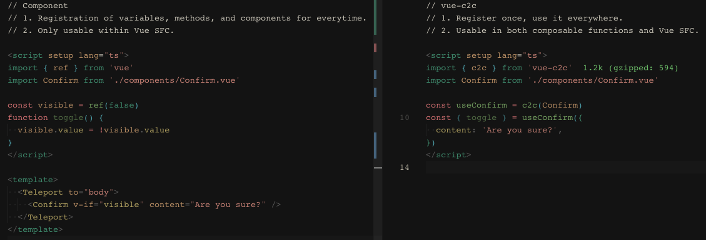

<p align="center">
 <h1>vue-c2c</h1>
</p>

<p align="center">
<b>Transforming Vue components to composable functions <br/>
 Draw UI with components, Access/Control with composables</b>
</p>


<p align="center">
<a href="https://stackblitz.com/edit/vue-c2c?embed=1&file=src/App.vue"></a>
</p>

## When should I use this?

In certain use cases (e.g. Confirm、Dialog), composable functions can provide greater flexibility and ease of use than components. 

<p align="left">
  <a href="https://github.com/webfansplz/vue-c2c"></a>
</p>

## Install

```bash
npm i vue-c2c
```

## Usage

### c2c

#### Options

```ts
interface VueC2COptions {
  /**
   * Display style of the component.
   * @default 'v-if'
   */
  display?: 'v-if' | 'v-show'
  /**
   * Display style of the component.
   * @default false
   */
  visible?: boolean
  /**
   * Function that returns an HTMLElement where the component should be appended to.
   * @default ()=> document.body
   */
  appendTo?: () => HTMLElement
}
```

```html
<script setup>
  import { c2c } from 'vue-c2c'
  import Dialog from './Dialog.vue'

  const useDialog = c2c(Dialog)

  const { visible, show, hide, toggle, exposed } = useDialog(props)
</script>
```

#### [Example](./examples/c2c)

### c2cWithTemplate

`c2cTemplate` is like `c2c`, but provides two additional features: 

- Element placeholder: 

  > The element placeholder functionality allows us to specify the location of created elements in a more flexible manner.

- Friendly SSR support:
  
  > If you're working on an SSR project (e.g. Nuxt), use `c2cTemplate` for better SSR support.

```ts
interface VueC2CWithTemplateOptions {
  /**
   * Display style of the component.
   * @default 'v-if'
   */
  display?: 'v-if' | 'v-show'
  /**
   * Display style of the component.
   * @default false
   */
  visible?: boolean
}
```

```html
<script setup>
  import { c2cWithTemplate } from 'vue-c2c'
  import Dialog from './Dialog.vue'

  const useDialog = c2cWithTemplate(Dialog)

  const { template: Placeholder, visible, show, hide, toggle, exposed } = useDialog(props)
</script>

<template>
  <Placeholder>
    Hello World
  </Placeholder>
</template>
```

#### [Example](./examples/c2c-with-template)


## License

[MIT](./LICENSE) License © 2023
